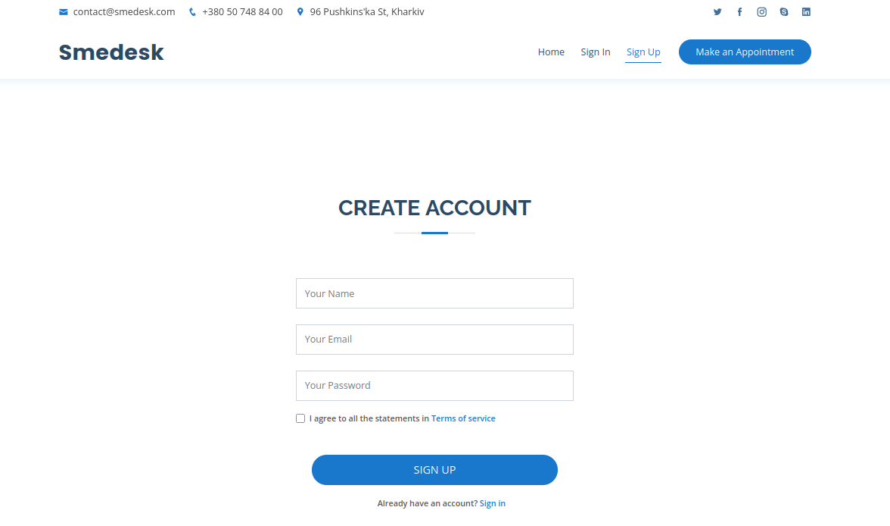

# smedeskapp

This is a single-page application front end for https://github.com/okharkevych/smedesk

Visual design is based on bootstrap template from https://bootstrapmade.com/demo/Medilab/

In this app, the following web pages were developed: landing page, sign-up, sign-in, and dashboard.

 
  

 
  

 
  

 
  

